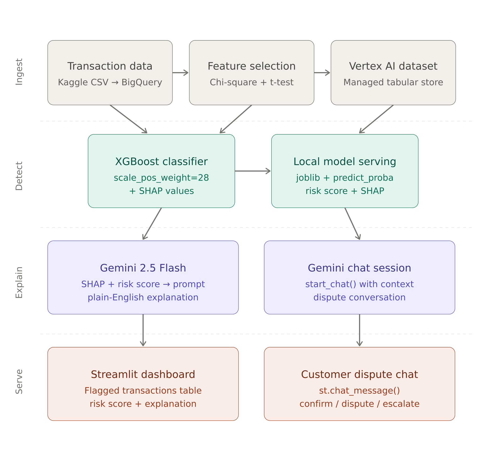

# Fraud Explanation Assistant
### AI-Powered Fraud Detection with Plain-English Customer Explanations

## Overview
This project is an AI-powered fraud detection and explanation system built for customer-facing credit and fraud risk teams. It uses XGBoost to flag suspicious transactions, SHAP to identify the top contributing risk factors, and Gemini 2.5 Flash (via Vertex AI) to translate those factors into plain-English explanations for customers. What makes it unique is the end-to-end pipeline — from detection to explanation to dispute resolution — all surfaced through a Streamlit agent dashboard with a built-in Gemini-powered chat interface.

**Key features:**
- Real-time fraud probability scoring
- SHAP-powered explainability per transaction
- Gemini-generated plain-English customer explanations
- Interactive dispute chat — confirm, dispute, or escalate
- Agent dashboard with flagged transaction table and risk scores

## Architecture


## Demo
[Watch the demo](https://youtu.be/l4I1XY4tQfY)

### Layers
- **Layer 1 — Ingest**: IEEE-CIS transaction data loaded from Kaggle into BigQuery, registered as a Vertex AI Managed Dataset
- **Layer 2 — Detect**: XGBoost classifier trained with scale_pos_weight=28 for class imbalance, SHAP values extracted per transaction
- **Layer 3 — Explain**: Gemini 2.5 Flash generates plain-English explanations from SHAP + risk score, dispute handled via start_chat()
- **Layer 4 — Serve**: Streamlit dashboard shows flagged transactions, risk scores, Gemini explanations, and dispute chat

## Tech Stack
| Layer | Technology |
|---|---|
| Data | BigQuery, Google Cloud Storage |
| ML Model | XGBoost, scikit-learn |
| Explainability | SHAP |
| LLM | Gemini 2.5 Flash via Vertex AI |
| Dashboard | Streamlit |
| Cloud | Google Cloud Platform |

## Dataset
- IEEE-CIS Fraud Detection — Kaggle
- 590,540 transactions, 3.5% fraud rate
- https://www.kaggle.com/competitions/ieee-fraud-detection

## Model Performance
| Metric | Score |
|---|---|
| Accuracy | 0.92 |
| Recall | 0.80 |
| Precision | 0.27 |

> Recall is prioritized over precision — missing real fraud is more costly than false positives in production systems.

## How to Run
```bash
git clone https://github.com/yourusername/fraud-explanation-assistant
pip install -r requirements.txt
gcloud auth application-default login
streamlit run app.py
```

```
fraud-explanation-assistant/
├── app.py
├── fraud_detection.ipynb
├── xgboost_model.joblib
├── original_categories.csv
├── requirements.txt
└── README.md
```
