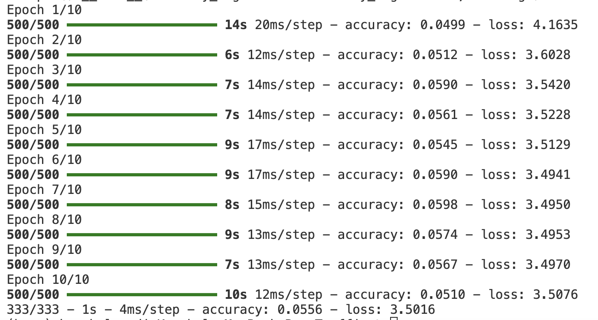

### README Summary

Dataset: https://benchmark.ini.rub.de/?section=gtsrb&subsection=news

This project implements and compares two convolutional neural network (CNN) architectures on the German Traffic Sign Recognition Benchmark (GTSRB) dataset using TensorFlow/Keras for the task of road sign classification across 43 categories of road signs such as stop signs, speed limit signs, yield signs, and so on.

# Model 1
The first model uses a relatively shallow architecture with 2 convolutional layers (64 and 32 filters) followed by max pooling, flattening, and only 1 dense hidden layer, and a softmax output. It achieves a training accuracy of ~5.6% and a test accuracy of ~5.4% over 10 epochs. Despite using fewer layers, it consumes more training time per epoch due to larger filter sizes and higher complexity in early layers.

# Model 2
The second model takes a different apporach by using only 1 convolutional layer (32 filters) and a larger max pooling size, followed by an extensive series of densely connected layers with dropout for regularization (to prevent overfitting). This model trains signficantly faster (6-10s per epoch) and shows slighly imporved test accuracy ~5.4%.

Note: baseline accuracy is 1/43= 2.3%.