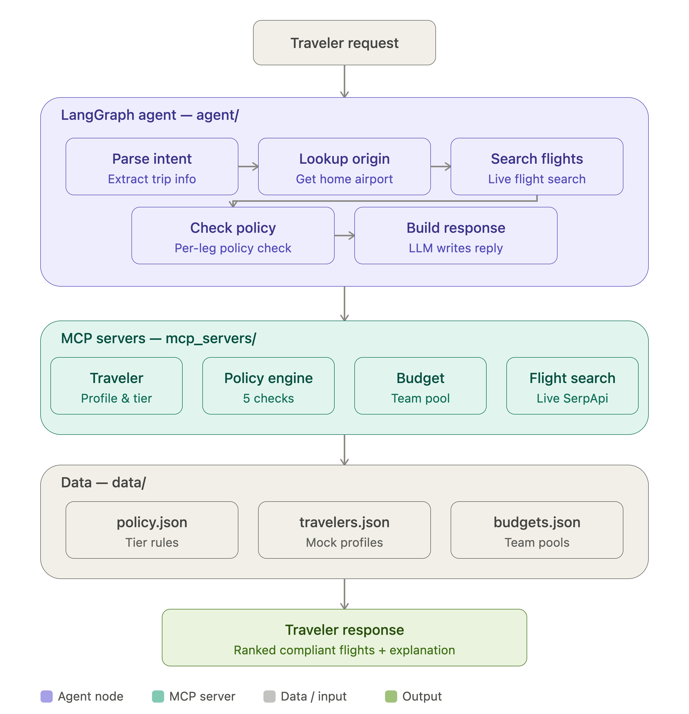

# Travel - GPT Agent

A corporate travel agent that plans and verifies trips against company policy — built 
to mirror Hyper's Travel-GPT roadmap, from scratch, as a technical exploration of what 
that product likely requires under the hood.

## Demo
🎥 **[Watch the demo](https://www.loom.com/share/4f445384c81f4ea9b207790419efdb52)**

## What it does

A traveler enters their employee ID, destination, and departure date. The agent:

- Looks up the traveler's tier, team, and home airport from their profile
- Searches live flight data
- Validates every flight — and every leg of every flight — against corporate 
  travel policy (cabin class, approved airlines, advance booking window, 
  per-trip budget cap, and remaining team budget)
- Returns a ranked list of compliant options with a clear explanation of 
  why any flight was excluded, and what to do next

## Architecture

A five-node LangGraph agent orchestrates four independent MCP servers:

1. **Parse intent** — extracts the destination airport code and defaults 
   cabin preference from the traveler's request. The node is also built to 
   extract employee ID and dates from free text — the Streamlit UI currently 
   collects those as structured form fields instead, but the underlying 
   agent handles either path.
2. **Lookup origin** — pulls the traveler's home airport from their profile 
   rather than asking the LLM to guess it
3. **Search flights** — queries live flight data via SerpApi
4. **Check policy** — validates every leg of every flight against the 
   traveler's tier, in a fixed short-circuit sequence
5. **Build response** — synthesizes the final natural-language reply

## Policy engine (the core innovation)

This is the part of the system that makes it *corporate* travel, not consumer 
travel search. Every flight option runs through five sequential checks, 
short-circuiting on the first failure:

1. Approved airline — checked **per leg**, not just the first segment. 
   A multi-leg international itinerary with a disapproved carrier on a 
   later leg is correctly caught, not silently passed.
2. Advance booking window
3. Cabin class (tier-based hierarchy: economy → premium economy → business)
4. Per-trip budget cap
5. Remaining team budget pool

Each check returns a structured pass/fail with a plain-English reason, so 
the final response can explain *exactly* why a flight was excluded — not 
just that it was.

## MCP servers

| Server | Responsibility |
|---|---|
| `traveler_profile` | Traveler tier, team, home airport, loyalty programs |
| `policy_engine` | The five policy checks above |
| `budget` | Team budget pool lookup and (future) deduction |
| `flight_search` | Live flight search via SerpApi |

Each server is independently testable and swappable — in production, 
`flight_search` would connect to Amadeus or a GDS instead of SerpApi.

## What's next

- Hotel and car rental search, mirroring Hyper's full trip-planning scope
- Rebooking disrupted trips
- Real booking/audit-trail persistence (currently the agent recommends, 
  it doesn't execute a booking)
- Cloud deployment (currently runs locally via Streamlit + local MCP subprocesses)

## Tech stack

LangGraph · MCP (FastMCP) · Claude (via LangChain) · SerpApi · Streamlit · Python